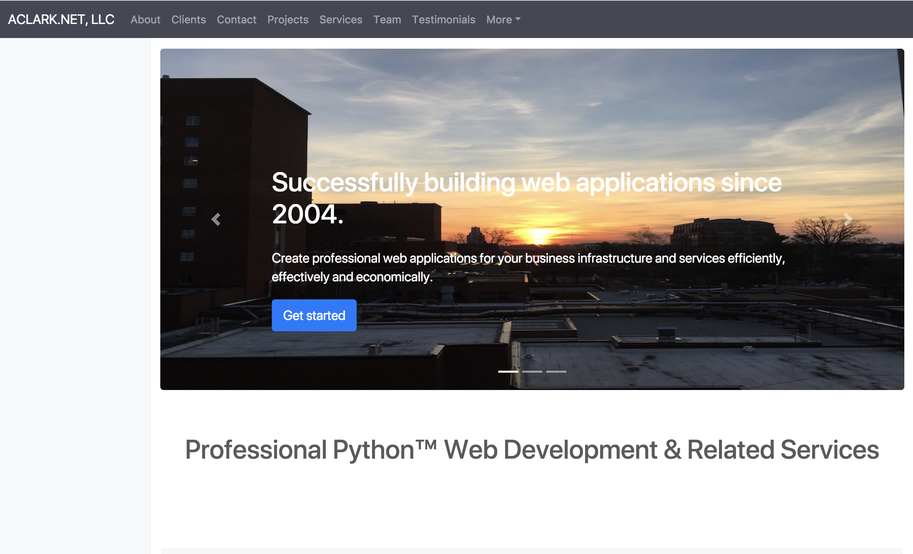

ACLARK.NET, LLC Website
=======================

AWS
~~~

::

    Ubuntu 16.04.1 LTS

::

    sudo add-apt-repository ppa:certbot/certbot
    sudo apt-get update
    sudo apt-get install aptitude awscli graphviz graphviz-dev jq letsencrypt \
        libpq-dev libxml2 libxml2-dev libxslt-dev make nginx pkg-config       \
        libgdal-dev \
        postgresql python python-pip python3 python3-pip python-virtualenv    \
        python3-virtualenv python-dev -y
    sudo aptitude upgrade -y

systemd
~~~~~~~

::

    sudo systemctl enable /srv/aclarknet-website/systemd/www.service 
    sudo systemctl start www.service 

NGINX
~~~~~

::

    cd /etc/nginx/sites-enabled
    sudo ln -s /srv/aclarknet-website/nginx/www

Letsencrypt
~~~~~~~~~~~

::

    sudo certbot certonly

::

    Saving debug log to /var/log/letsencrypt/letsencrypt.log

    How would you like to authenticate with the ACME CA?
    -------------------------------------------------------------------------------
    1: Spin up a temporary webserver (standalone)
    2: Place files in webroot directory (webroot)
    -------------------------------------------------------------------------------
    Select the appropriate number [1-2] then [enter] (press 'c' to cancel): 1
    Starting new HTTPS connection (1): acme-v01.api.letsencrypt.org
    Please enter in your domain name(s) (comma and/or space separated)  (Enter 'c'
    to cancel):aclark.net
    Obtaining a new certificate
    Performing the following challenges:
    tls-sni-01 challenge for aclark.net
    Waiting for verification...
    Cleaning up challenges

    IMPORTANT NOTES:
     - Congratulations! Your certificate and chain have been saved at
       /etc/letsencrypt/live/aclark.net/fullchain.pem. Your cert will
       expire on 2017-10-06. To obtain a new or tweaked version of this
       certificate in the future, simply run certbot again. To
       non-interactively renew *all* of your certificates, run "certbot
       renew"
     - If you like Certbot, please consider supporting our work by:

       Donating to ISRG / Let's Encrypt:   https://letsencrypt.org/donate
       Donating to EFF:                    https://eff.org/donate-le

Django
~~~~~~

If memory < 1G, increase swap before installing. [1]_

::

    sudo dd if=/dev/zero of=/swapfile bs=1024 count=524288
    sudo chmod 600 /swapfile
    sudo mkswap /swapfile
    sudo swapon /swapfile

Then:

::

    git clone git@github.com:ACLARKNET/aclarknet-website.git
    sudo mv aclarknet-website /srv
    cd /srv/aclarknet-website
    virtualenv --python=python3 .
    bin/pip install -r requirements.txt

.. [1] http://stackoverflow.com/a/26762938/185820
